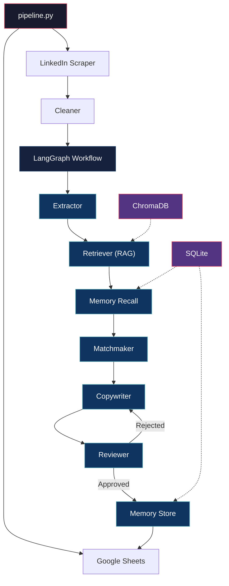

# Keryx

Keryx scrapes LinkedIn profiles, runs them through a chain of local AI agents, and spits out personalized cold outreach messages. I built it to automate internship cold-mailing, but the bones work for any LinkedIn outreach.

Named after the Greek word for "herald." The person who actually carried the message.

## What it does

Feed it LinkedIn URLs through a Google Sheet. Keryx handles the rest:

1. **Scrapes** the target's full LinkedIn profile (experience, skills, posts) using Playwright in stealth mode
2. **Extracts** structured data from the raw page text using a local LLM
3. **Finds the angle** by comparing your background against theirs (shared college, overlapping tech stack, their recent posts)
4. **Writes the messages**: a connection note under 300 characters and a follow-up DM around 150 words
5. **Reviews them** for AI slop, banned phrases, and whether a real person would actually respond
6. **Pushes results** back to Google Sheets

Everything runs on your machine. No OpenAI. No cloud APIs. Ollama and your GPU.

## Architecture



If the Reviewer rejects a draft, it sends specific feedback back to the Copywriter. The Copywriter rewrites based on that feedback, not blindly. Max 2 retries before it takes whatever it has.

## Setup

### What you need

- Python 3.12+
- [uv](https://docs.astral.sh/uv/)
- [Ollama](https://ollama.ai/) running locally with a model pulled
- A Google Cloud service account with Sheets API enabled

### Install

```bash
git clone https://github.com/dis70rt/keryx.git
cd keryx
uv sync
uv run playwright install chromium
```

### Configure

```bash
cp .env.example .env
```

Open `.env` and fill in:

```env
SENDER_LINKEDIN_URL=https://www.linkedin.com/in/your-profile/
LLM_MODEL=gemma4:e2b
ADMIN_EMAIL=your.email@gmail.com
GOOGLE_SHEETS_CRED_PATH=data/google_credentials.json
```

### Your data

Drop these into the `data/` folder:

| File | Purpose |
|------|---------|
| `resume.tex` | Your resume. Gets chunked and indexed by the RAG system. |
| `projects.json` | Your projects. The Copywriter pulls specific details from this. |
| `google_credentials.json` | Service account key for Google Sheets API. |

### Pull your model

```bash
ollama pull gemma4:e2b
```

### First run: LinkedIn login

Keryx needs your LinkedIn session cookies. Run this once:

```bash
uv run python src/tools/login.py
```

Browser opens. Log in manually. Session saves to `data/auth_state.json`.

## Usage

### Add targets

In your Google Sheet (defaults to "Keryx Outreach"), go to the "Targets" tab and add rows:

| User Linkedin URL | Company Linkedin URL | Name | Misc Info |
|---|---|---|---|
| `https://linkedin.com/in/someone/` | `https://linkedin.com/company/their-co/` | Their Name | Any notes |

### Run

```bash
uv run pipeline.py
```

### What you see

```
┌──────────────────────────────────────────┐
│ KERYX OUTREACH PIPELINE                  │
└──────────────────────────────────────────┘

[>] Building RAG index for sender context
  [OK] RAG index ready (16 chunks)
[INFO] Found 2 pending targets in Google Sheets

┌──────────────────────────────────────────┐
│ Processing: linkedin.com/in/someone/     │
└──────────────────────────────────────────┘

[>] [Extractor] Parsing profiles
[>] [Retriever] Finding relevant sender context
  [OK] Retrieved 5 relevant context chunks
[>] [Matchmaker] Generating angles
[>] [Copywriter] Drafting messages (revision #0)
[>] [Reviewer] Quality check
  [OK] Approved
  [OK] Hook stored in episodic memory

  [OK] Connection Note (187 chars)
  [OK] DM Message (115 words)
```

Results land in the "Connection Notes" and "DM Messages" tabs of the same sheet.

## Project structure

```
keryx/
├── pipeline.py                    # Entry point
├── src/
│   ├── agents/
│   │   ├── profile_extract.py     # Raw text to Pydantic models
│   │   ├── matchmaker.py          # Finds connection angles
│   │   ├── copywriter.py          # Writes the messages
│   │   └── reviewer.py            # Quality gate
│   ├── core/
│   │   ├── config.py              # Settings from .env
│   │   ├── llm_client.py          # Ollama wrapper
│   │   ├── logger.py              # Rich console output
│   │   ├── models.py              # TargetProfile, CompanyProfile, etc.
│   │   ├── state.py               # SQLite state tracking
│   │   └── workflow.py            # LangGraph graph
│   ├── prompts/                   # System prompts as markdown
│   └── tools/                     # Scraper, cleaner, RAG, memory, sheets
├── data/                          # Resume, projects, credentials
├── Makefile
└── pyproject.toml
```

## RAG

Your resume and projects get split into ~500 character chunks and indexed in a local ChromaDB vector store. When the pipeline processes a target, the Retriever queries the store using the target's skills and tech stack and pulls the 3 most relevant chunks. So the Copywriter gets "built a distributed task queue in Go" instead of your entire resume crammed into the context window.

## Episodic memory

When the Reviewer approves a message, the winning hook gets saved to SQLite, tagged by the target's industry and job title. Next time the Matchmaker sees a similar profile, it pulls those past hooks as few-shot examples. Starts empty. Gets sharper the more you use it.

## Known limitations

- Local LLMs sometimes produce garbage tokens when context gets too heavy. The pipeline catches this and auto-approves the last good draft instead of crashing.
- Memory starts cold. First batch of targets won't have past hooks to learn from.
- LinkedIn scraping breaks when LinkedIn changes their DOM. Expect occasional maintenance.
- Output quality scales with model size. `gemma4:e2b` works. Bigger models write better.

## License

MIT
